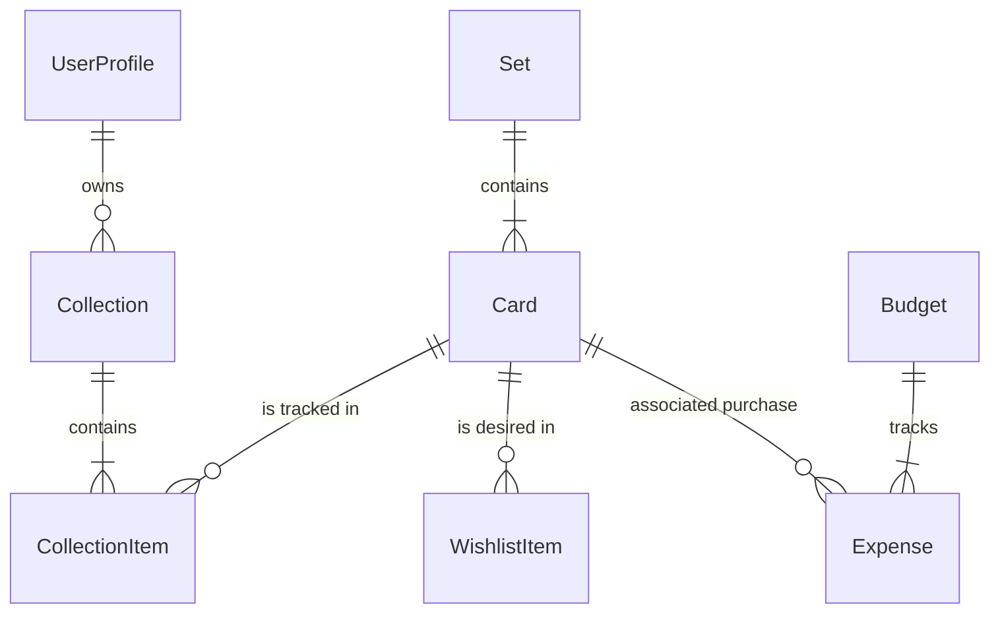

# Arquitectura y Guía de Desarrollo - HoloStack

Este documento técnico describe la arquitectura interna, decisiones de diseño y flujos de datos de **HoloStack**. Está destinado a desarrolladores que deseen entender, mantener o extender el proyecto.

---

## 🏗️ Stack Tecnológico

HoloStack está construido sobre un stack moderno y eficiente, priorizando el rendimiento, la experiencia de usuario y la facilidad de despliegue.

### Core
*   **Framework**: [Next.js 14](https://nextjs.org/) (App Router) - Renderizado híbrido (SSR/CSR) y API Routes.
*   **Lenguaje**: [TypeScript](https://www.typescriptlang.org/) - Tipado estático estricto para seguridad y DX.
*   **Runtime**: Node.js (Compatible con Docker/Alpine).

### Datos y Almacenamiento
*   **Base de Datos**: [SQLite](https://www.sqlite.org/) - Base de datos local, ligera y de archivo único (`sqlite.db`). Ideal para auto-alojamiento por ser "zero-config".
*   **ORM**: [Drizzle ORM](https://orm.drizzle.team/) - Acceso a datos type-safe, ligero y con excelente performance SQL.

### Interfaz de Usuario (UI)
*   **Styling**: [Tailwind CSS](https://tailwindcss.com/) - Utility-first CSS.
*   **Componentes**: [Shadcn/UI](https://ui.shadcn.com/) (Radix UI) - Componentes accesibles y personalizables copiados al proyecto.
*   **Iconos**: [Lucide React](https://lucide.dev/).
*   **Animaciones**: `framer-motion` (para micro-interacciones complejas) y `tailwindcss-animate`.

### Integraciones Externas
*   **Pokémon TCG Data**: [TCGdex API](https://tcgdex.dev/) - Fuente de metadatos de cartas, sets e imágenes.
*   **Precios**: Scraping/API de Cardmarket y TCGPlayer (vía `src/lib/prices.ts`).
*   **Nombres**: [PokeAPI](https://pokeapi.co/) - Fuente secundaria para índice de autocompletado de especies.

---

## 📂 Estructura del Proyecto

```bash
src/
├── app/                  # Next.js App Router
│   ├── api/              # API REST Endpoints (Backend)
│   │   ├── sync/         # Endpoints SSE para sincronización
│   │   └── ...
│   ├── collections/      # Páginas de gestión de colecciones
│   ├── layout.tsx        # Layout raíz (Providers: Theme, I18n, Tooltip)
│   └── page.tsx          # Landing / Dashboard
├── components/           # Componentes React
│   ├── ui/               # Primitivas de diseño (Button, Card, Dialog...)
│   │   └── ...           # (Basados en Shadcn)
│   └── ...               # Componentes de negocio (CollectionGrid, PriceCard)
├── db/                   # Capa de Datos
│   ├── index.ts          # Inicialización de cliente Drizzle
│   └── schema.ts         # Definición de tablas y relaciones
├── lib/                  # Utilidades y Lógica Core (Pure Functions) - Ver [UTILITIES.md](./UTILITIES.md)
│   ├── pokemon-utils.ts  # Normalización de nombres para Pokédex
│   ├── budget-logic.ts   # Cálculo de presupuestos y arrastre mensual
│   ├── stats-logic.ts    # Agregaciones de portfolio y valor total
│   ├── proxy-utils.ts    # Procesamiento de metadatos para proxies
│   ├── date-utils.ts     # Gestión de caducidad de precios y fechas
│   ├── card-utils.ts     # Reglas de variantes (Holo, Reverse, etc)
│   ├── prices.ts         # Cálculo y normalización de precios
│   └── utils.ts          # Helpers generales (cn, formats)
├── locales/              # Archivos JSON de traducción (es.json, en.json)
└── services/             # Servicios de integración externa
    └── tcgdex.ts         # Cliente tipado para API TCGdex
```

---

## 💾 Diseño de Base de Datos

El esquema relacional está diseñado para separar los **Datos Maestros** (inmutables, vienen de la API) de los **Datos de Usuario** (mutables).

### Diagrama Conceptual



### Tablas Clave (`src/db/schema.ts`)

1.  **Datos Maestros (Solo Lectura / Sync)**
    *   `sets`: Información de expansiones (Base Set, Paldean Fates).
    *   `cards`: Cartas individuales. Almacena JSONs complejos (`images`, `prices`, `attacks`) para flexibilidad.
    *   `pokemon_species`: Índice ligero de nombres para autocompletado rápido.

2.  **Datos de Usuario**
    *   `collections`: Contenedores. Pueden ser `manual` (lista explícita) o `auto` (basada en filtros dinámicos).
    *   `collection_items`: Instancias físicas de cartas. Relaciona `Collection` + `Card` + `Variant` (Holo/Reverse) + `Quantity` + `Notes`.

3.  **Finanzas**
    *   `budgets`: Presupuestos (Mensuales/Anuales). Pueden agruparse jerárquicamente.
    *   `expenses`: Gastos individuales. Opcionalmente vinculados a una carta específica.

---

## 🔄 Flujos Críticos y Patrones

### 1. Sincronización de Datos (SSE)
HoloStack no trae una base de datos pre-poblada. Sincroniza datos bajo demanda para mantener la app ligera.
*   **Problema**: Descargar 15,000 cartas por HTTP tradicional da timeout.
*   **Solución**: Server-Sent Events (SSE).
*   **Implementación**: `src/app/api/cards/[setId]/route.ts`.
    1.  Cliente solicita sync.
    2.  Servidor abre stream.
    3.  Descarga chunks de TCGdex.
    4.  Upsert en SQLite.
    5.  Emite eventos de progreso (`data: { status: 'progress', percent: 50 }`).

### 2. Colecciones Automáticas
Permiten crear colecciones como "Todos los Pikachu" sin añadir cartas una a una.
*   **Lógica**:
    1.  Se guarda un filtro JSON en `collections.filters` (ej: `{ name: "Pikachu", rarity: "Rare" }`).
    2.  El endpoint de sincronización (`/api/sync/collection-cards`) busca en TCGdex cartas que cumplan el filtro.
    3.  Las descarga a la tabla `cards`.
    4.  La vista de colección hace una query dinámica: `SELECT * FROM cards WHERE name LIKE '%Pikachu%'`.
    5.  **Pokédex Nacional**: Para colecciones globales, se realiza un `LEFT JOIN` ultra-robusto con `pokemon_species`. La lógica normaliza nombres (eliminando espacios, guiones, puntos y acentos) tanto en la tabla de cartas como en la de especies para garantizar un matching del 100% (aprox. 1025 especies).

### 3. Internacionalización (i18n)
Sistema híbrido personalizado para máximo rendimiento sin overhead de frameworks pesados.
*   **Cliente**: Hook `useI18n()` que consume un `I18nContext`.
    *   Carga `es.json` o `en.json`.
    *   Traduce UI instantáneamente.
*   **Datos Dinámicos**: Las cartas tienen nombres en inglés (API base).
    *   El usuario puede elegir `Card Language` en perfil.
    *   HoloStack intenta buscar traducciones si la API las provee, o mantiene inglés como fallback universal.

### 4. Gestión de Precios y Estadísticas
El valor de mercado es volátil y requiere agregaciones complejas.
*   **Fuente**: TCGdex provee precios diarios ("low", "mid", "market").
*   **Cálculo**: `src/lib/prices.ts` -> `getBestPrice()`.
*   **Agregación**: `src/lib/stats-logic.ts` procesa el portfolio entero para generar distribuciones por rareza y series, aplicando conversiones de moneda en tiempo real.

### 5. Finanzas y Presupuestos (Carry-over)
HoloStack implementa un sistema de presupuesto "inteligente" para coleccionistas.
*   **Lógica de Arrastre**: Implementada en `src/lib/budget-logic.ts`. El dinero no gastado de un mes se suma automáticamente al presupuesto del mes siguiente (o se resta si hubo déficit).
*   **Periodos**: Soporta presupuestos mensuales (recurrentes), anuales (divididos por 12) y de pago único (*one-time*).

### 6. Centro de Proxies
Permite crear cartas de sustitución para testeo de mazos.
*   **Parser**: `src/lib/proxy-utils.ts` extrae ataques, habilidades y costes de energía de los metadatos JSON para renderizar la `TextProxyCard` de forma legible y compacta.

### 5. Autenticación Dual
Para facilitar el despliegue local (Docker en casa) y remoto (VPS).
*   **Modo LOCAL**: `APP_MODE=LOCAL`. El backend asume usuario `guest`. No pide login. Ideal para un solo usuario en red casera.
*   **Modo SERVER**: `APP_MODE=SERVER`. Activa `NextAuth.js`. Requiere login. (Preparado en arquitectura, implementación UI pendiente).

---

## 🎨 UI/UX System

### Componentes Atómicos
No se usa CSS global indiscriminado. Todo está modularizado en componentes `src/components/ui/`.
*   Ejemplo: `<Button variant="ghost" size="sm" />`.

### Tema
*   Definido en `src/app/globals.css` usando variables CSS (`--background`, `--foreground`).
*   Esto permite **Temas Dinámicos** (Carmesí, Océano, Oscuro) cambiando solo valores HSL en tiempo de ejecución.

### Animaciones
Uso extensivo de `framer-motion` para:
*   Layout Transitions (al cambiar de grid a lista).
*   Gestos (Swipe para borrar en móvil).
*   Micro-feedback (Botones pulsados).
*   **Poker Hand Interaction**: Lógica de abanico para slots con múltiples cartas, gestionando `z-index` dinámico y transformaciones 3D.

---

## 🛠 Comandos de Desarrollo

```bash
# Iniciar servidor desarrollo
npm run dev

# Generar migraciones Drizzle (si cambias schema.ts)
npx drizzle-kit generate:sqlite

# Aplicar cambios a la DB local
npx drizzle-kit push:sqlite

# Studio para ver datos (Interfaz gráfica de Drizzle)
npx drizzle-kit studio
```

---

## ⚠️ Consideraciones de Rendimiento

1.  **Imágenes**: Las imágenes de cartas son URLs externas. El navegador las cachea, pero la primera carga de una colección grande puede ser pesada. Se usa `loading="lazy"` nativo.
2.  **Base de Datos**: SQLite escala bien hasta ~100GB. Para colecciones de millones de cartas (teórico), se recomienda índices adecuados en `cards.setId` y `collection_items.cardId` (ya implementados).
3.  **Bulk Operations**: La inserción masiva se hace en transacciones para asegurar integridad y velocidad.
